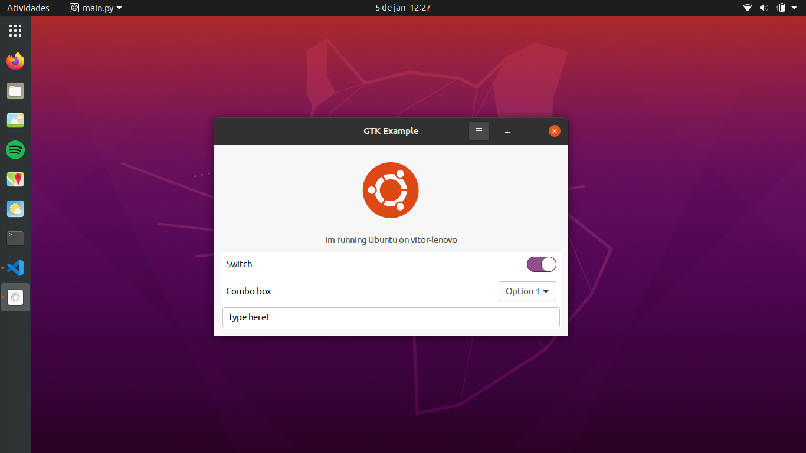
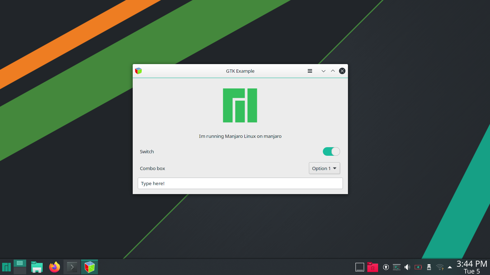
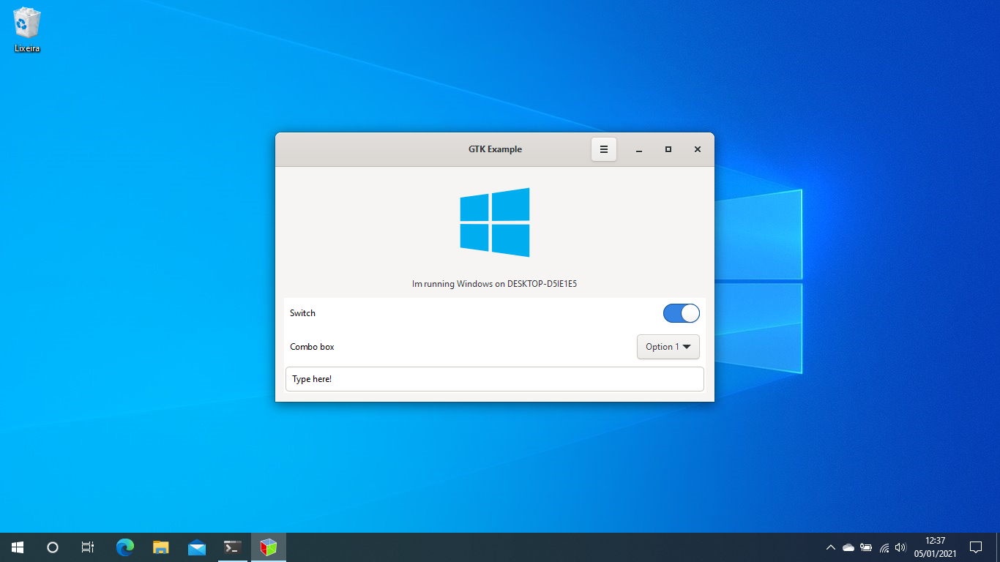

# GTK Example

## About

Example demonstrating how to build some basic widgets with Python 3 and GTK+. 

[GTK](https://www.gtk.org/) is a free and open-source cross-platform widget toolkit for creating graphical user interfaces.

## Screenshots

## More tutorials and samples

* [GNOME - Tutorials, code samples and platform demos in Python](https://developer.gnome.org/gnome-devel-demos/stable/py.html.en)
* [GTK](https://www.gtk.org/)
* [GitHub - natorsc/gui-python-gtk: Criando interfaces gráficas com Python e GTK.](https://github.com/natorsc/gui-python-gtk)